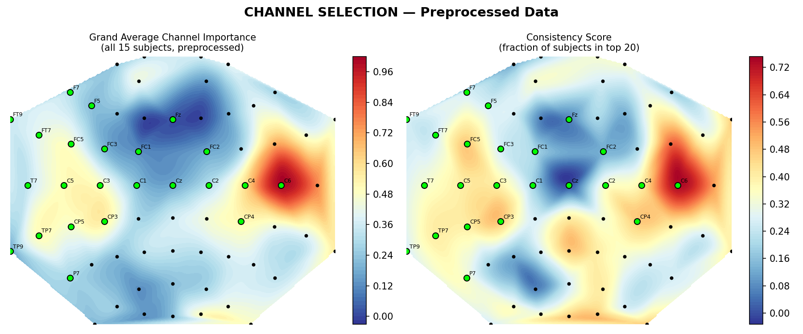
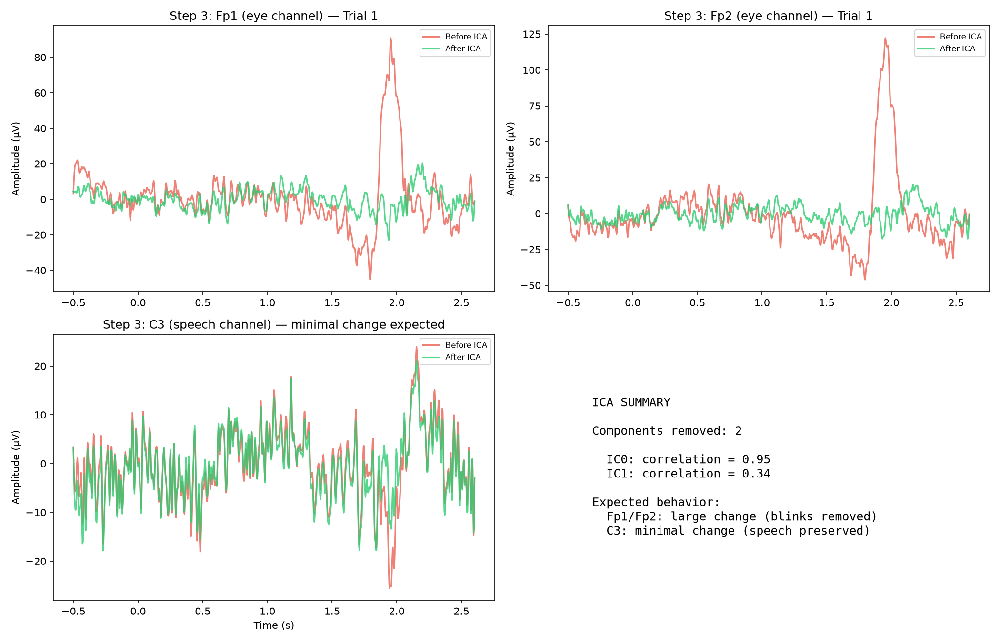
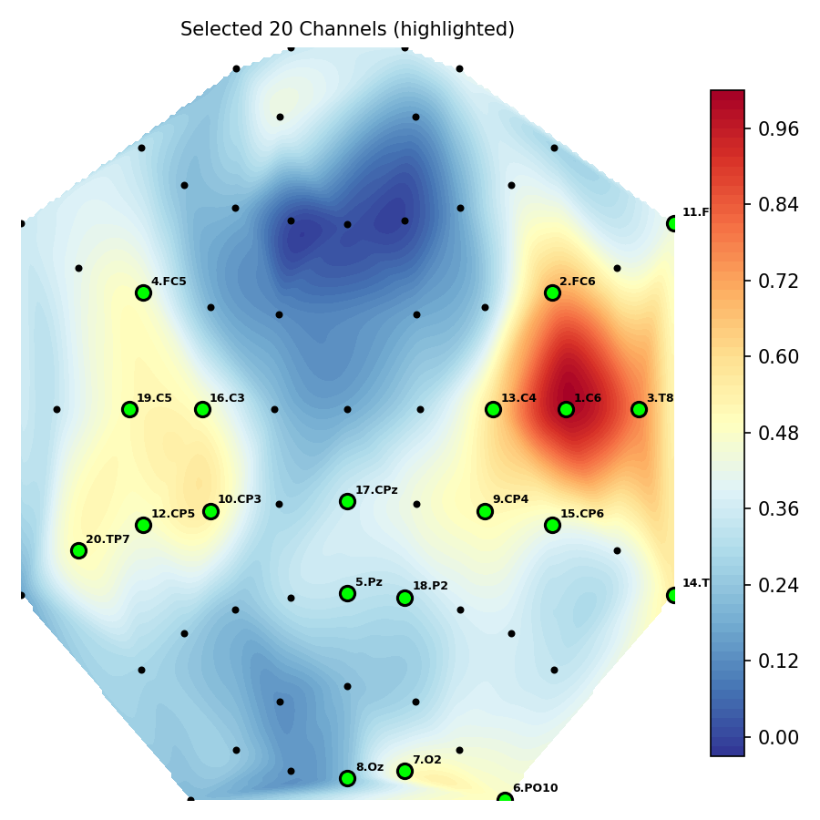
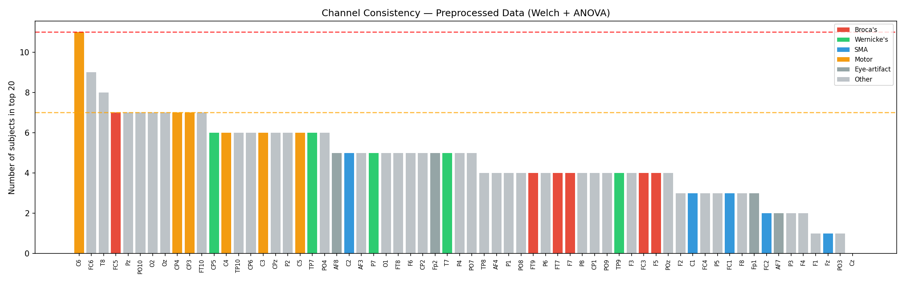
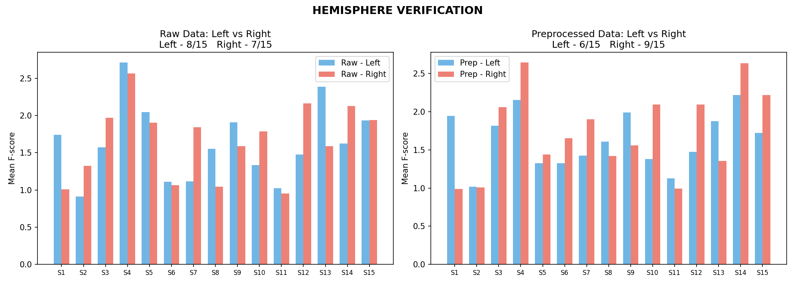

# EEG-Based Imagined Speech Recognition Using Deep Learning


> Can we decode what someone is *thinking* of saying, purely from their brain activity? This project takes 64-channel EEG recordings of people imagining five different words — "Hello", "Help me", "Stop", "Thank you", "Yes" — and builds a classification pipeline from raw signal all the way through to deep learning, without any speech or muscle movement involved.

<p align="center">
  
  <br/>
  <em>Grand-average ANOVA F-score topographic map across 15 subjects — brighter regions carry more discriminative power for separating the five imagined words.</em>
</p>

---

## Background

People with ALS, locked-in syndrome, or severe stroke often retain full cognitive function but lose the ability to speak. EEG-based brain-computer interfaces could let them communicate by decoding intended speech directly from neural activity — no muscle movement, no eye tracking, just thought.

The catch is that imagined speech produces extremely weak and noisy EEG signals compared to overt speech. Most published systems report 20–40% accuracy on multi-class tasks when tested across subjects, and cross-subject generalization is still largely unsolved. This project takes a systematic approach: build and validate a rigorous preprocessing and channel selection pipeline first, then apply deep learning on a clean foundation.

---

## Dataset

**BCIC 2020 Track #3** — Multi-class Imagined Speech Classification ([osf.io/pq7vb](https://osf.io/pq7vb))

| Property | Value |
|---|---|
| Subjects | 15 (S1–S15), aged 20–30 |
| Task | Silently imagine saying one of 5 words — no vocalization or articulator movement |
| Classes | Hello, Help me, Stop, Thank you, Yes |
| Channels | 64 (10-20 system), BrainAmp amplifier |
| Sampling rate | 256 Hz |
| Reference / Ground | FCz / Fpz |
| Trials | 70 per class per subject (60 train, 10 validation) |
| Epoch window | −500 ms to +2600 ms relative to auditory cue |
| Format | Per-subject `.mat` files with signal (`epo`) and montage (`mnt`) |

---

## Completed Work

### 1. Preprocessing Pipeline

Five-stage cleaning validated on all 15 subjects:

```
Raw EEG (64 ch, 256 Hz)
    → Bandpass filter (0.5–50 Hz)      — removes DC drift and high-freq noise
    → 50 Hz notch filter               — kills power line interference
    → ICA artifact removal             — spots and removes eye-blink components
                                         using Fp1/Fp2 correlation
    → Common Average Reference (CAR)   — subtracts mean across all 64 channels
    → Baseline correction              — zeros the pre-cue window (−500 to 0 ms)
```

<p align="center">
  
  <br/>
  <em>ICA decomposition — eye-blink components identified and removed.</em>
</p>

Each step was validated with cumulative SNR comparison to make sure it actually improves signal quality rather than just adding processing for its own sake.

**SNR results across all 15 subjects:**

| | Value |
|---|---|
| Mean Raw SNR | 4.08 ± 2.07 dB |
| Mean Preprocessed SNR | 15.51 ± 1.70 dB |
| **Mean Improvement** | **+11.43 ± 2.15 dB** |
| Subjects improved | 15 / 15 |

Full per-subject breakdown in [`SNR_RESULT.txt`](SNR_RESULT.txt).

### 2. Channel Selection

64 channels is a lot — many of them carry mostly noise or eye-movement artifacts for this particular task. We used a data-driven approach to narrow down to the channels that consistently help separate the five word classes:

1. Extracted band power in four frequency bands (theta, alpha, low-beta, low-gamma) per channel using Welch PSD
2. Ran one-way ANOVA per channel to quantify class separability
3. Ranked channels independently for each of the 15 subjects
4. Counted how many subjects placed each channel in their top 20 — the "consistency" score

**Key finding:** Only **C6** over the right motor cortex showed strong consistency (11/15 subjects). The final 20-channel subset includes 9 channels in speech-relevant regions (Broca's area, Wernicke's area, motor cortex, SMA).

<p align="center">
  
  
  <br/>
  <em>Left: Final 20-channel subset on the scalp. Right: Cross-subject consistency ranking.</em>
</p>

Full 64-channel ranking with brain region annotations in [`OP_IMAGES/CHANNEL_SELECTION_RESULT.txt`](OP_IMAGES/CHANNEL_SELECTION_RESULT.txt).

### 3. Hemisphere Verification

There's a common assumption that imagined speech should lateralize to the left hemisphere (Broca's and Wernicke's areas). We tested this explicitly:

- Right hemisphere scored only 1.7% higher on raw data, 6.8% higher after preprocessing
- Per-subject split was nearly even: 8 vs 7 (raw), 6 vs 9 (preprocessed)
- Variation is down to individual differences, not consistent group-level lateralization

<p align="center">
  
</p>

---

## In Progress

### Feature Extraction (Step 4)

Two non-linear feature types from the cleaned, channel-selected data:

- **Morlet CWT Scalograms** — time-frequency power per channel per trial, capturing when and at what frequency neural activity shifts during word imagery
- **Phase Locking Value (PLV)** — functional connectivity between channel pairs per frequency band, measuring phase synchronization during imagined speech

### Deep Learning Classification (Step 5)

Candidate architectures from the literature:

| Model | Why |
|---|---|
| CNN | Baseline; works well on short-window frequency features |
| LSTM / BiLSTM | Captures temporal structure in scalogram sequences |
| CNN-2-BiLSTM | Best reported result on 30-class imagined speech (Elwasify et al., 2026) |
| Spectro-Temporal Transformer | Multi-head attention on Morlet features; strongest LOSO results (Milyani & Attar, 2025) |

Validation will use Leave-One-Subject-Out (LOSO) to properly test cross-subject generalization.

---

## Repo Structure

```
eeg-imagined-speech/
├── CODES/
│   ├── step1_explore_data.py              # Dataset loading and structure inspection
│   ├── channel_selection_preprocessed_kk.py  # ANOVA channel ranking (preprocessed)
│   ├── step2_channel_selection(…).py      # Channel ranking variants (raw signal)
│   ├── step3_preprocessing_pipeline.py    # Full 5-stage pipeline, saves .npz per subject
│   ├── step3_ica_preprocessing_only.py    # Standalone ICA artifact removal
│   ├── step3_validation_plots.py          # Single-trial before/after visualisation
│   ├── validation_plots_10trials.py       # 10-trial overlay validation
│   ├── snr_validation.py                  # SNR: raw vs preprocessed across 15 subjects
│   ├── hemisphere_verification.py         # Left vs right hemisphere comparison
│   └── step4_feature_extraction.py        # Morlet scalograms + PLV (in progress)
├── OP_IMAGES/
│   ├── validation_plots/                  # Before/after plots per preprocessing stage
│   ├── channel_selection_results/         # Topomaps, consistency charts per subject
│   ├── hemisphere_verification/           # Hemisphere F-score comparison plot
│   └── CHANNEL_SELECTION_RESULT.txt       # Full 64-channel ranking table
├── SNR_RESULT.txt                         # Per-subject SNR validation
├── requirements.txt
├── .gitignore
└── README.md
```

---

## Setup

```bash
git clone https://github.com/kkl24062006-commits/eeg-imagined-speech.git
cd eeg-imagined-speech
pip install -r requirements.txt
```

Download the BCIC 2020 dataset from [osf.io/pq7vb](https://osf.io/pq7vb) and place `.mat` files in a local `data/` directory (not tracked — these are ~2 GB).

### Dependencies

```
numpy
scipy
matplotlib
mne
scikit-learn
h5py
```

---

## Running

```bash
# Explore dataset structure
python CODES/step1_explore_data.py

# Channel selection
python CODES/channel_selection_preprocessed_kk.py

# Preprocess all 15 subjects
python CODES/step3_preprocessing_pipeline.py

# Validate preprocessing
python CODES/snr_validation.py
python CODES/step3_validation_plots.py

# Feature extraction (in progress)
python CODES/step4_feature_extraction.py
```

Update the `RAW_DATA_DIR` and `PREPROCESSED_DATA_DIR` paths at the top of each script to point at your local data.

---

## References

1. Rusnac & Grigore (2022). CNN Architectures and Feature Extraction Methods for EEG Imaginary Speech Recognition. *Sensors*.
2. Alharbi & Alotaibi (2024). Decoding Imagined Speech from EEG Data: A Hybrid Deep Learning Approach. *Life*.
3. Milyani & Attar (2025). Deep Learning for Inner Speech Recognition: EEGNet vs Spectro-Temporal Transformer. *Frontiers in Human Neuroscience*.
4. Alonso-Vázquez et al. (2025). From Pronounced to Imagined: Improving Speech Decoding with Multi-Condition EEG Data. *Frontiers in Neuroinformatics*.
5. Elwasify et al. (2026). EEG Imagined Speech Neuro-Signal Preprocessing and Deep Learning Classification. *Scientific Reports*.

> These citations are from the project's literature review. Verify DOIs before using in academic submissions.

---

## Context

Final-year project, Department of Biomedical Engineering, CEG, Anna University. Guide: Dr. G. Kavitha, Professor.

---

## License

MIT — free for research and educational use.
